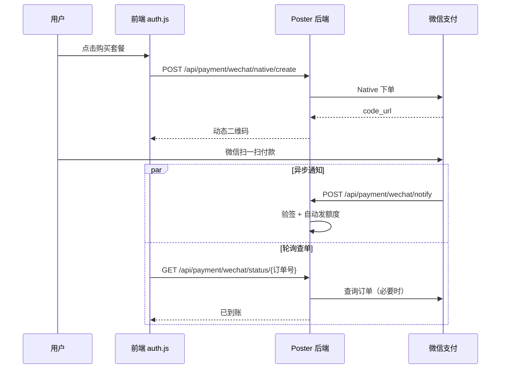

# 微信支付 Native 部署与操作手册

> 适用于 Poster 生成器及所有复用 `web/auth.js` + `web/modals.html` 的页面（首页、定价页、生成页等）。

---

## 一、能不能不用公众号？

**不能完全不用 APPID，但不一定非要「订阅号/服务号公众号」这一种。**

微信 Native 支付下单接口 **必须传 `appid`**，且该 APPID 必须与商户号 **1747467120** 完成绑定。可选类型（任选其一）：

| 类型 | 是否必须认证 | 典型场景 |
|------|--------------|----------|
| **服务号 / 政府或媒体公众号** | 是 | 有公众号、菜单导流 |
| **小程序** | 是 | 小程序内支付（可配合 Native 扫码） |
| **移动应用（开放平台）** | 是 | App 场景 |

**结论：**

- ❌ 不能只有商户号、没有任何 APPID 就调 Native 接口  
- ✅ **不必**为了 PC 扫码单独再做一个「内容型公众号」——有 **小程序 APPID** 或 **移动应用 APPID** 也可以  
- ✅ PC 用户用 **微信扫一扫** 扫动态码即可，**不需要**用户关注公众号  

若你目前 **只有商户号、还没有任何 APPID**，请先在微信侧完成下面「平台侧必做步骤」第 4–5 步（申请并绑定 APPID）。

---

## 二、平台侧必做步骤（微信商户平台 / 公众平台）

对照微信官方 Native 流程，你需要完成：

1. **已有商户号** `1747467120`（普通商户）✅  
2. 在 [商户平台](https://pay.weixin.qq.com/) 开通 **Native 支付** 产品权限  
3. 准备一个 **APPID**（服务号 / 小程序 / 移动应用），并完成 **认证**  
4. 在商户平台 **发起 APPID 授权绑定**，并在公众平台/开放平台 **确认绑定**  
5. 设置 **APIv3 密钥**（32 位，与 `config.json` 中一致）  
6. 下载 **商户 API 证书**（`apiclient_key.pem`）→ 已放到 `data/apiclient_key.pem`  
7. 配置 **支付通知 URL**（必须 HTTPS 公网）：  
   `https://你的正式域名/api/payment/wechat/notify`  
8. （建议）为技术负责人配置商户平台子账号  

**本地开发**：通知 URL 无法指向 `127.0.0.1`，可依赖前端 **轮询查单**（已实现）；上线后务必配置公网 HTTPS 回调。

---

## 三、本系统配置（`data/config.json`）

```json
{
  "api_key": "你的图片生成 API Key",
  "wechat_pay": {
    "enabled": true,
    "mch_id": "1747467120",
    "app_id": "wxXXXXXXXXXXXXXXXX",
    "api_v3_key": "你的32位APIv3密钥",
    "serial_no": "78BA5864395EE2D36586BEE0A0802AB34A275715",
    "private_key_path": "data/apiclient_key.pem",
    "notify_url": "https://你的正式域名/api/payment/wechat/notify",
    "trade_type": "native"
  }
}
```

| 配置项 | 说明 |
|--------|------|
| `app_id` | **必填**，与商户号绑定的 APPID（填好后 `wechat_pay_ready` 才为 true） |
| `serial_no` | 商户 API 证书序列号（当前证书：`78BA5864395EE2D36586BEE0A0802AB34A275715`） |
| `private_key_path` | 商户私钥 PEM，**勿提交 git** |
| `notify_url` | 支付成功异步通知地址 |

配置完成后重启服务：

```bash
pip install -r requirements.txt
python server.py
```

验证：访问 `/api/config`，应看到 `"payment_mode": "wechat_native"` 且 `"wechat_pay_ready": true`。

---

## 四、支付流程（与微信官方一致）



**用户侧注意（微信官方要求）：**

- 必须用 **扫一扫** 扫屏幕上的码  
- ❌ 不支持长按识别、相册识别  

---

## 五、复用到其他页面

所有包含 `modals.html` + `auth.js` 的页面 **无需改代码**，只要：

1. 页面 `import "/auth.js"`（版本号 bump 后刷新缓存）  
2. 触发 `window.dispatchEvent(new CustomEvent("poster:open-payment", { detail: "single_50" }))`  

套餐 ID 与 `poster_platform.PAYMENT_PLANS` 一致，例如：`single_50`、`pack_20`、`pack_100`、`consult_5000`、`vip_10000`、`bulk`。

**行为切换：**

| `wechat_pay_ready` | 支付弹窗行为 |
|--------------------|--------------|
| `false` | 旧模式：静态收款码 + 上传截图 |
| `true` | Native 官方动态码 + 自动到账，**禁止截图提交** |

---

## 六、运维与对账

| 操作 | 位置 |
|------|------|
| 查看支付记录 | 用户「支付记录」/ 管理后台「支付」Tab |
| 对账 | [商户平台](https://pay.weixin.qq.com/) → 交易中心 → 账单 |
| 日志 Request-ID | 服务端日志 `WeChat Pay ... Request-ID=...`，排查时提供给微信客服 |
| 关闭截图自动开通 | 环境变量 `PAYMENT_AUTO_APPROVE=0`（启用微信官方支付后建议设置） |

---

## 七、上线检查清单

- [ ] `app_id` 已填写且与商户号已绑定  
- [ ] `notify_url` 为 **HTTPS 公网** 且 nginx 已反代到 `server.py`  
- [ ] `data/apiclient_key.pem` 存在且权限安全  
- [ ] `pip install cryptography` 已执行  
- [ ] 用 **0.01 元测试单** 或最小套餐验证：扫码 → 额度自动增加  
- [ ] 生产环境 `PAYMENT_AUTO_APPROVE=0`  
- [ ] **勿**在聊天/代码库中泄露 APIv3 密钥与私钥（若已泄露请轮换密钥）

---

## 八、常见问题

**Q：配置了仍显示上传截图？**  
A：`wechat_pay_ready` 为 false。检查 `app_id`、证书路径、证书序列号是否齐全。

**Q：下单报错 APPID 与 mch_id 不匹配？**  
A：商户平台未完成 APPID 绑定，或 `app_id` 填错。

**Q：付了款额度没到账？**  
A：看 notify 是否可达；本地开发依赖轮询查单；查服务器日志中的 Request-ID。

**Q：和 JSAPI 的区别？**  
A：Native = PC/任意浏览器展示二维码扫码；JSAPI = 仅微信内置浏览器调起收银台。当前已实现 **Native**；若需 JSAPI 可二期接入。

---

## 九、API 接口一览（供二次开发）

| 方法 | 路径 | 说明 |
|------|------|------|
| POST | `/api/payment/wechat/native/create` | 创建订单，返回 `code_url`、`qr_image_url` |
| GET | `/api/payment/wechat/status/{claim_id}` | 查询/同步支付状态 |
| POST | `/api/payment/wechat/notify` | 微信异步通知（仅微信服务器调用） |
| GET | `/api/config` | 含 `payment_mode`、`wechat_pay_ready` |

---

*文档版本：2026-06-26 · 商户号 1747467120 · Native 支付*
